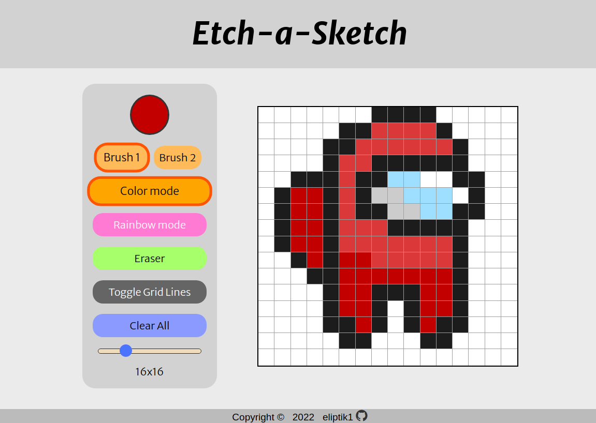

# Etch-a-Sketch

This is a basic pixel sketch app created using HTML & CSS and Javascript.

## Technologies Used

- HTML
- CSS
- Javascript
- Git

## Features

- Color Picker: Implement color selection for pixel placement.
- Rainbow Colors: Enable dynamic color variation where each drawn pixel takes on a different color.
- Eraser: Provide pixel removal functionality.
- Change Grid Size: Enable pixel grid dimensions adjustment.
- Toggle Grid Lines: Allow toggling grid line visibility.
- Bold Brush: Larger brush size for pixels.

## Demo

Check out the live demo: [Etch-a-Sketch Demo](https://eliptik1.github.io/etch-a-sketch/)

## Screenshots

## License

This project is open-source and available under the MIT License.